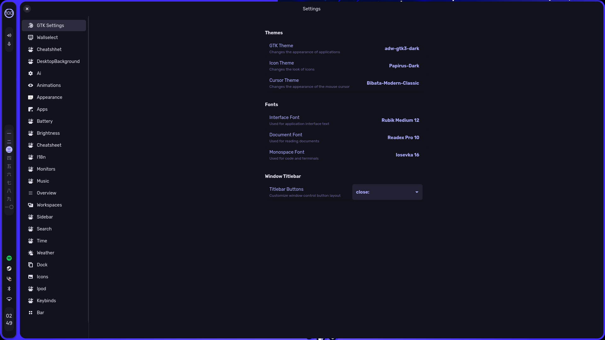
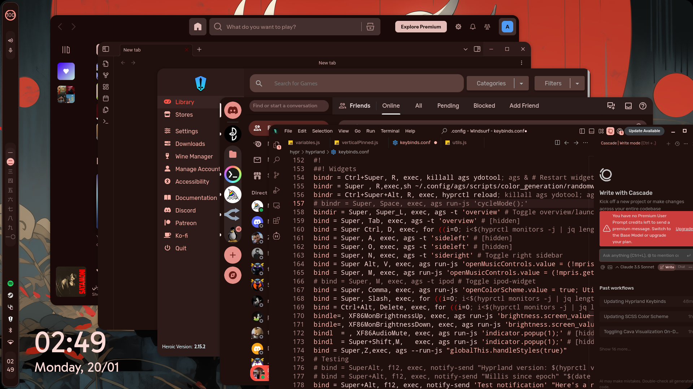
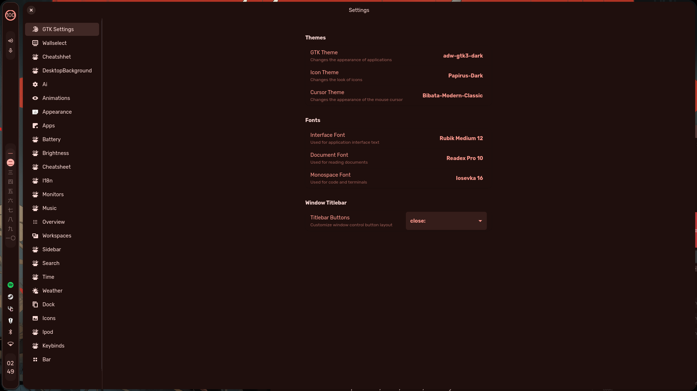
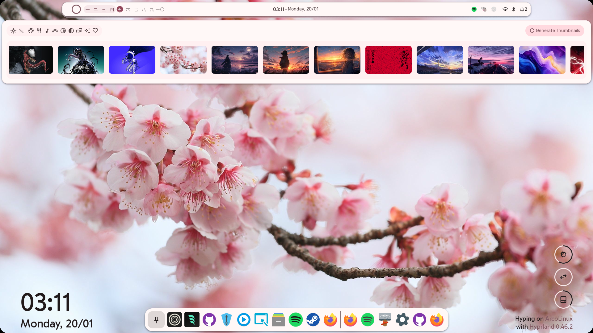
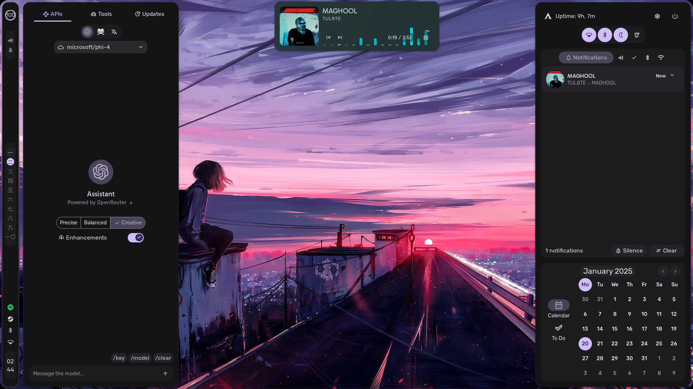
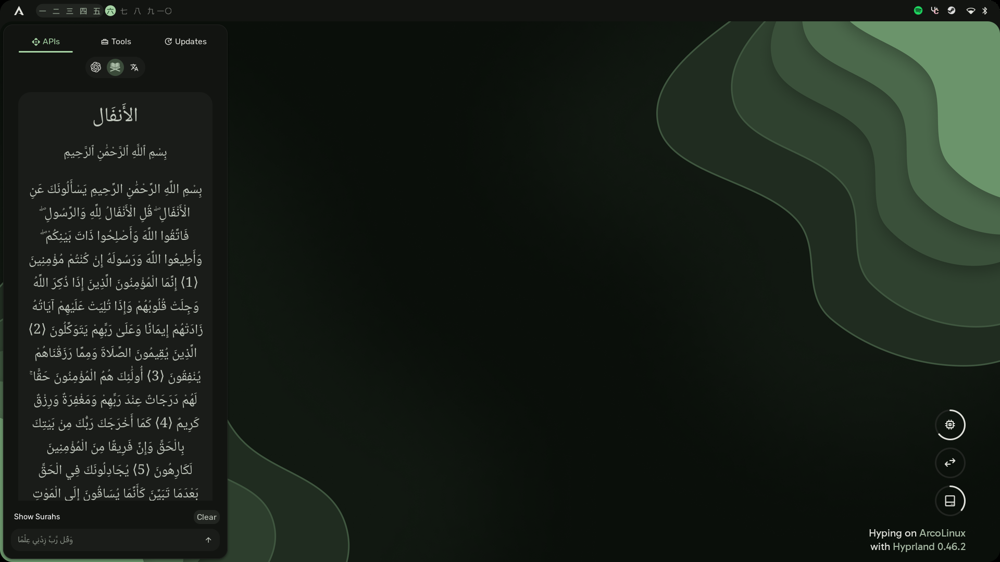
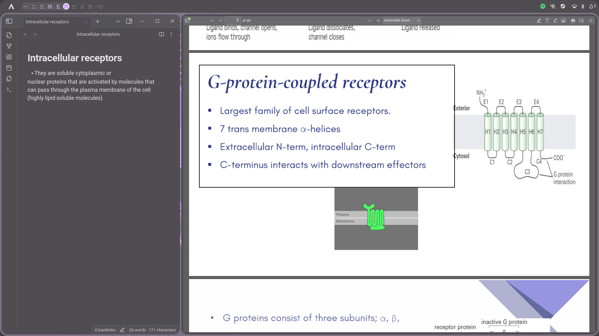

<div align="center">
    <h1>【 Pharmaracism's Hyprland Rice 】</h1>
    <p align="center">
      
    </p>
</div>

<div align="center"> 

[](https://github.com/pharmaracist/dots-hyprland/stargazers)
[](https://github.com/pharmaracist/dots-hyprland/commits/main)
[](https://github.com/pharmaracist/dots-hyprland)
[](https://github.com/pharmaracist/dots-hyprland/blob/main/LICENSE)
[](https://github.com/pharmaracist/dots-hyprland/issues)
[](https://archlinux.org/)
[](https://hyprland.org/)

</div>

<div align="center">
    <h2>🌟 My Personal Spaghetti Coded Dotfiles on Hyprland/AGS 🌟</h2>
</div>

<p align="center">
  
  
  
</p>

<details open> 
<summary>✨ Features</summary>

<details>
<summary>🚀 Installation</summary>
### 💻 Manual Installation:
If you prefer to see what's being installed, you can manually clone and run the installation script:

```bash
# Clone the repository
git clone https://github.com/pharmaracist/dots-hyprland.git

# Change to the directory
cd dots-hyprland

# For Arch Linux
chmod +x install.sh
./install.sh

# For Fedora WIP ⏱️
chmod +x install-fedora.sh
./install-fedora.sh
```

## 🖼️ Pics

<div align="center">
  <details open>
    <summary>📸 Screenshots</summary>
    <br/>
    
  <div style="display: grid; grid-template-columns: repeat(2, 1fr); gap: 10px;">
    
    
    
    
    
<!--      -->
<!--      -->
  </div>

  </details>
</div>

## 🙏 Credits
- My GF for the support hehe !!
- Claude 3.5 sonnet for the Help in Development
- End-4 for the original Hyprland rice
- Sh1zicus for the help to make this work and the awesome kickstart 
- Hyprland community
- All the amazing ricers at Unixporn
- osu!lazer, Novelknocks , Hybrid , AvdanOS (concept), Old End4 Configs

*Note: This README was made by AI cuz im too lazy to write it myself! ..Pharmaracist*
